# cs411-academicworld-dashboard
dashboard-to-rule-the-academic-world by Justin Hoffman

## Purpose

*Author: Justin Hoffman*  
*Contact: jrh10@illinois.edu*

**Application scenario:**  
A web-based dashboard that helps prospective graduate students and researchers explore and enhance the Academic World dataset. Users can discover leading faculty, research interests, and top universities, while authorized users can clean and update the underlying data.

**Target users:**  
- Prospective graduate students researching programs and advisors
- Researchers seeking collaboration or insights into university research strengths
- Academic administrators or database maintainers who need to review, update, or enrich faculty information

**Objectives:**  
- Make it easy to discover faculty, research keywords, and universities using advanced filters and interactive visualizations.
- Provide rich publication and citation statistics, as well as detailed faculty profiles.
- **Allow authorized users to edit faculty profiles directly in the dashboard, keeping data current across all backend databases.**
- **Enable authorized users to automatically generate and update research interests for faculty, based on publication data.**
- Facilitate data cleaning and quality control, allowing authorized users to correct errors or enrich information.

## Demo

[Video Demo: Dashboard to Rule the Academic World](https://mediaspace.illinois.edu/media/t/1_orrdfje0)


_The demo covers:_
- Target users and application scenario
- Databases used (MySQL, MongoDB, Neo4j)
- Overview and walkthrough of all six widgets
- How to use the dashboard to explore, edit, and update data
- Demonstration of advanced database techniques
- Extra-credit capabilities

## Screenshots

### Main Dashboard

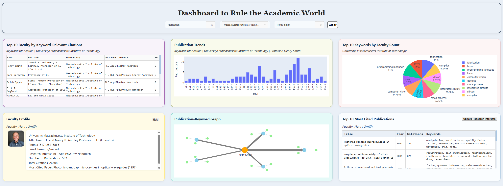

### Widgets

#### Widget 1: Top 10 Faculty by Keyword-Relevant Citations
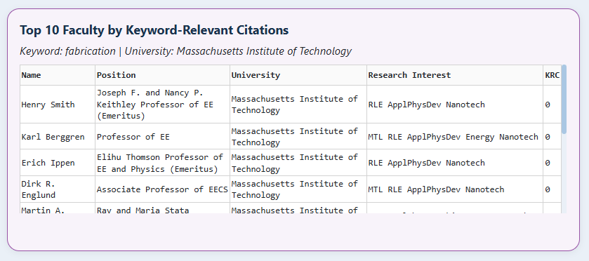

#### Widget 2: Keyword Publication Trends
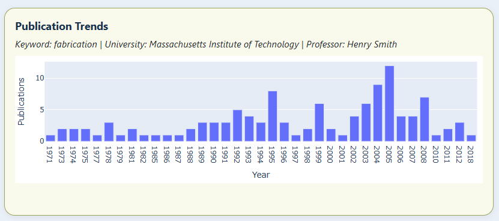

#### Widget 3: Top 10 Keywords by Faculty Count
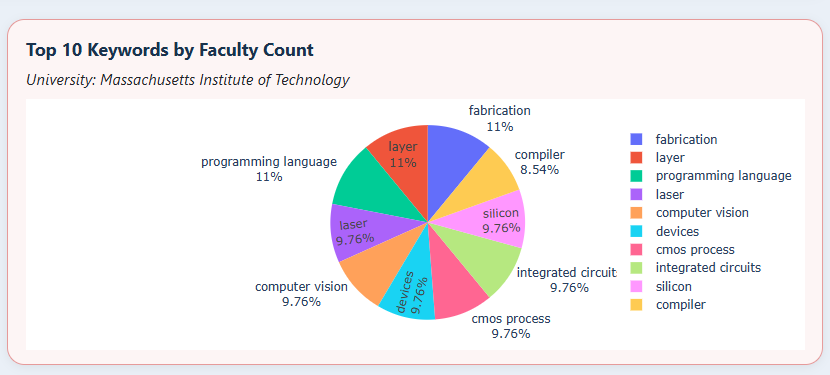

#### Widget 4: Faculty Profile (View & Edit)
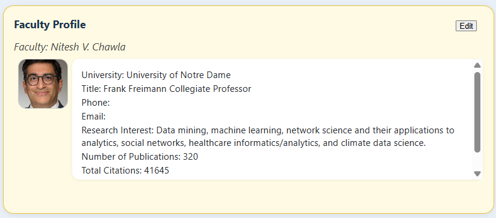

#### Widget 5: Publication–Keyword Graph
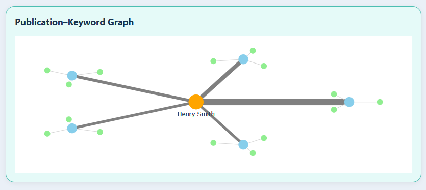

#### Widget 6: Top 10 Most Cited Publications by Faculty
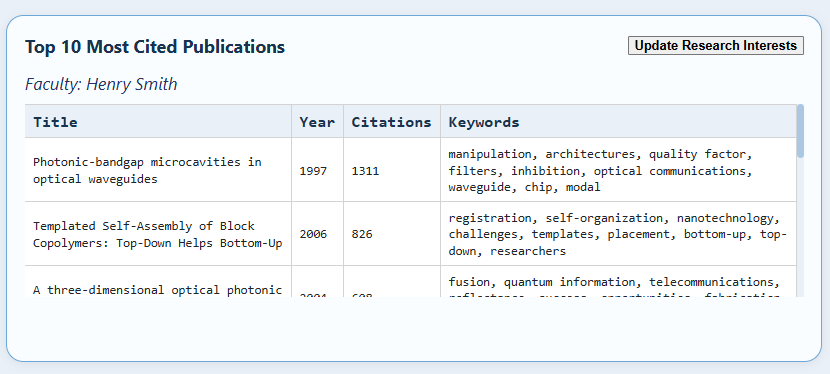

## Installation

1. **Clone the repository:**

   [GitHub Repository](https://github.com/CS411DSO-SU25/cs411-academicworld-dashboard)
   
   ```bash
   cd cs411-academicworld-dashboard
   ```

3. **Install Python dependencies:**
   ```bash
   pip install -r requirements.txt
   ```

4. **Set up the databases:**
   - Make sure MySQL, MongoDB, and Neo4j are running on your machine.
   - Import the Academic World dataset.

5. **Update database credentials if needed:**
   - If your database connection info (host, username, or password) is different from the defaults in `utils.py`, edit that file to match your setup.

6. **Run the application:**
   ```bash
   python app.py
   ```

7. **Open the dashboard in your browser:**
   - Navigate to [http://localhost:8050](http://localhost:8050)
   
## Usage

1. **Start the application** as described in the Installation section.  
   Open [http://localhost:8050](http://localhost:8050) in your browser.

2. **Filtering and Search:**
   - Use the keyword and faculty search bars, and the dropdowns, to filter data by research interest, faculty member, or university.
   - The dashboard will auto-update widgets as you select filters.

3. **Exploring Widgets:**

- **Top 10 Faculty by Keyword-Relevant Citations:**

  - **What:**  
    This widget shows a ranked table of the top 10 faculty members whose publications have received the most citations for a **selected research keyword**. The ranking can also be **filtered by university**, so users can focus on specific institutions or see overall leaders in a field. The table provides the following information for each faculty member:
      - Faculty Name
      - Position/Title
      - University
      - Research Interest
      - Keyword-Relevant Citation (KRC) score (total citations of publications associated with the selected keyword)

  - **Filters that affect this widget:**  
    - **Keyword filter** (required): Only faculty with publications associated with this keyword are included and ranked.
    - **University filter** (optional): Restricts the ranking to faculty from the selected university.
    - The widget also resets if the "Clear" button is clicked.

  - **Why:**  
    Helps users (students, researchers, or administrators) identify the most impactful faculty in a given research area, based not just on publication count but on *influence within that topic*. Useful for selecting advisors, planning collaborations, or analyzing university strengths.

  - **How:**  
    - On filter selection, a **parameterized SQL query** is executed:
      - Joins `faculty`, `faculty_publication`, `publication_keyword`, `keyword`, and `university`.
      - Filters for the selected keyword (and university, if specified).
      - Sums the citation scores relevant to the keyword (KRC).
      - Sorts and limits the result to the top 10 faculty.
    - The resulting data is shown in a Dash DataTable, updating live with any change in filters.

  - **Information provided:**  
    For each ranked faculty, you see their name, position, university, specific research interest, and their total keyword relevant citation count giving both context and quantitative impact.

  - **Where implemented:**  
    - **File:** `widget1.py`
    - **Function:** `update_table`
    - The SQL logic and data table display are both managed within this function.
    
    
- **Keyword Publication Trends:**

  - **What:**  
    This widget displays a bar chart showing the **number of publications per year** that match the selected filters. Users can observe how research output trends have changed over time for specific keywords, universities, and faculty.

  - **Filters that affect this widget:**  
    - **Keyword filter (optional):** Limits the count to publications associated with the chosen research keyword.
    - **Faculty filter (optional):** Shows only publications authored by the selected faculty member.
    - **University filter (optional):** Shows only publications from faculty at the chosen university.
    - The widget also responds to the "Clear" button, which resets all filters.

  - **Information provided:**  
    For each year, the bar chart displays the **total number of publications** matching the active filters. This lets users quickly see peaks, trends, or drops in research activity.

  - **Why:**  
    Enables users to visualize how academic interest in specific topics has evolved over time helpful for identifying emerging research areas, trends in faculty or university productivity, and periods of high scholarly activity. Useful for prospective students, researchers, and academic planners.

  - **How:**  
    - On any filter selection, a **parameterized SQL query** is constructed:
      - Joins publication data with relevant tables based on the selected filters.
      - Groups and counts publications by publication year.
      - Results are sorted chronologically.
    - The resulting data is rendered as a Plotly bar chart, updating live with any change in filters.

  - **Where implemented:**  
    - **File:** `widget2.py`
    - **Function:** `update_graph`
    - SQL logic and chart display are both handled in this function.
    
    
- **Top 10 Keywords by Faculty Count:**

  - **What:**  
    This widget presents a **pie chart** showing the top 10 research keywords, ranked by the number of faculty members associated with each keyword. This gives a quick overview of the most common research interests among faculty.

  - **Filters that affect this widget:**  
    - **University filter (optional):** When a university is selected, the widget limits its analysis to faculty from that institution.
    - The widget resets if the "Clear" button is clicked.
    - If no university is selected, the widget shows data across all universities.

  - **Information provided:**  
    For each of the top 10 keywords, the pie chart displays:
      - The keyword label
      - The number (and percentage) of faculty linked to that keyword

  - **Why:**  
    Helps users (especially prospective students or institutional analysts) understand what research areas are most prevalent or popular, either across the entire dataset or at a specific university. Useful for identifying university strengths, departmental focus areas, or potential collaborators.

  - **How:**  
    - When the filter changes, a **SQL query** is run against the `faculty_keyword_summary_view` MySQL view:
      - Counts unique faculty per keyword, optionally filtering by university.
      - Results are ordered by faculty count and limited to the top 10.
    - The resulting data is visualized as a pie chart using Plotly, which updates automatically with filter changes.

  - **Where implemented:**  
    - **File:** `widget3.py`
    - **Function:** `update_pie`
    - The function handles both the SQL query (using the view) and pie chart rendering.

- **Faculty Profile:**

  - **What:**  
    This widget displays a detailed profile of the currently selected faculty member. It includes key personal and professional information such as their photo, title, contact information, research interests, university affiliation, publication statistics, and citation counts. For authorized users, the widget also provides an **Edit** mode, allowing updates to the faculty’s information, which are then synchronized across all backend databases.

  - **Filters that affect this widget:**  
    - **Faculty filter (required):** The widget displays information for the currently selected faculty member from the dropdown menu.
    - The widget is cleared or reset if the "Clear" button is pressed or no faculty is selected.

  - **Information provided:**  
    - Photo (if available)
    - Name
    - University
    - Title/position
    - Phone number
    - Email address
    - Research interests
    - Number of publications
    - Total citations
    - Most cited paper (title and year)

  - **Why:**  
    Offers a centralized, comprehensive view of each faculty member valuable for prospective students seeking an advisor, researchers interested in collaborations, or administrators reviewing academic records. The ability to edit profile details (for authorized users) supports data maintenance and cleaning directly from the dashboard, ensuring accuracy across MySQL, MongoDB, and Neo4j.

  - **How:**  
    - When a faculty member is selected, the widget queries MySQL to retrieve profile details, publication stats, and research interests, displaying them in a visually organized card.
    - If “Edit” is clicked (and the user is authorized), fields become editable. Changes are saved by clicking “Update,” which triggers:
      - An UPDATE query to MySQL
      - A corresponding update to MongoDB and Neo4j to ensure all databases reflect the latest information
    - UI dynamically switches between view and edit mode.

  - **Where implemented:**  
    - **File:** `widget4.py`
    - **Function(s):** `update_indicator`, `update_profile`
    - The update logic, view rendering, and edit/save interactions are handled in these functions.

     
- **Publication–Keyword Graph:**

  - **What:**  
    This widget visualizes the network of a selected faculty member’s top publications and their most relevant research keywords. The graph places the faculty member at the center, surrounds them with their five most cited publications, and connects each publication to its three highest-scoring keywords. The network is interactive and helps users see research relationships at a glance.

  - **Filters that affect this widget:**  
    - **Faculty filter (required):** Only active when a faculty member is selected; the graph displays the network for that individual.
    - The graph clears if no faculty member is selected or if the "Clear" button is pressed.

  - **Information provided:**  
    - The selected faculty member (as the central node)
    - Up to 5 most cited publications (nodes connected to the faculty)
    - For each publication, up to 3 top keywords (nodes connected to publications)
    - Edge connections representing authorship and keyword labeling
    - Hover details: publication titles/citation counts, keyword names/scores

  - **Why:**  
    Provides a clear, visual summary of a faculty member’s research focus and impact, highlighting both the breadth and depth of their work. Useful for quickly assessing an individual’s research areas, identifying their most significant publications, and discovering their core academic interests.

  - **How:**  
    - When a faculty member is selected:
      - A Cypher query (via the Neo4j REST API) retrieves their top 5 publications by citation count.
      - For each publication, another Cypher query fetches the top 3 keywords with the highest score.
      - The data is mapped into a network structure and rendered as an interactive Plotly graph, with nodes for the faculty, publications, and keywords, and edges for their relationships.
    - The visualization is fully dynamic and updates on filter changes.

  - **Where implemented:**  
    - **File:** `widget5.py`
    - **Function:** `draw_graph`
    - Cypher queries and network graph construction are handled within this function.
    
- **Top 10 Most Cited Publications:**

  - **What:**  
    This widget displays a table listing the ten most cited publications of the currently selected faculty member. For each publication, it provides the title, publication year, citation count, and associated keywords. The widget also features an “Update Research Interests” button: authorized users can click this to automatically recalculate and update the faculty member’s research interests, based on a weighted analysis of publication keywords and citations, syncing the results across all databases.

  - **Filters that affect this widget:**  
    - **Faculty filter (required):** The table displays publications for the selected faculty member.
    - The widget is cleared if the "Clear" button is pressed or if no faculty member is selected.

  - **Information provided:**  
    For each publication in the top 10 (by citation count):
      - Title
      - Year
      - Number of citations
      - Associated keywords

  - **Why:**  
    Enables users to see at a glance the most impactful work of any faculty member, which is helpful for students seeking advisors, researchers looking for collaborations, or administrators evaluating academic output.  
    The “Update Research Interests” feature goes beyond read only reporting, letting users keep research profiles up to date automatically using objective publication data saving time and improving data accuracy.

  - **How:**  
    - When a faculty member is selected, a parameterized SQL query retrieves their top 10 most cited publications, joining publication and keyword tables for details.
    - Results are shown in a Dash DataTable with columns for title, year, citations, and keywords.
    - If the user clicks the “Update Research Interests” button:
      - The widget calculates a new research interest string, weighting keywords by publication citation counts.
      - Updates are then made to MySQL, MongoDB, and Neo4j using a coordinated set of queries and REST API calls to keep all databases in sync.

  - **Where implemented:**  
    - **File:** `widget6.py`
    - **Functions:**  
      - `load_top_cited_table` (loads and displays publication data)  
      - `update_research_interests` (calculates and updates research interests across databases)


4. **Clearing Filters:**  
   - Click the "Clear" button to reset all filters and widgets.

5. **Editing and Data Cleaning:**  
   - Only authorized users can edit faculty profiles or update research interests.  
   - Edits made in the dashboard are automatically synced across MySQL, MongoDB, and Neo4j databases.
   
## Design

### Overall Architecture

- **Frontend:**  
  Implemented with Dash (Python), providing a modern, interactive web-based dashboard interface.
- **Backend:**  
  Connects to three databases:
  - **MySQL:** Stores primary academic data faculty, universities, publications, keywords, and relationships.
  - **MongoDB:** Stores and updates research interests for faculty.
  - **Neo4j:** Used for graph-based queries and visualization, as well as constraints for data integrity.

### Components

- **app.py:**  
  The main Dash application. Handles layout, top-level callbacks, and integrates all widgets.
- **widget1.py to widget6.py:**  
  Each widget’s UI and callback logic is modularized in its own file, making code easier to maintain.
- **utils.py:**  
  Centralizes database connection logic (MySQL, MongoDB, Neo4j), helper functions, and credential configuration.
- **/assets/style.css:**  
  Custom CSS file placed in the `/assets` folder. Dash automatically applies these styles to control the appearance, layout, and visual consistency of the dashboard.

### Visual Layout

- The dashboard uses a rectangular, grid based arrangement for widgets, with search/filter controls in a persistent top bar.
- Each widget displays a different aspect of the data and updates dynamically as filters are applied.
- Custom CSS ensures consistent colors, padding, borders, and responsive layout.

## Implementation

The dashboard is implemented entirely in **Python** using the [Dash](https://dash.plotly.com/) framework for building interactive web applications.

### Major frameworks and libraries:

- **Dash:** For the frontend and callback-based interactivity.
- **Plotly:** For charts and custom visualizations.
- **pandas:** For data manipulation.
- **MySQL Connector (mysql-connector-python):** For connecting to MySQL.
- **PyMongo:** For accessing MongoDB.
- **requests:** For making REST API calls to Neo4j.
- **Custom CSS (in `/assets`):** For consistent and responsive layout.

### Structure and Flow:

- The application’s main entry point is `app.py`, which defines the overall layout, header, and integrates all widgets.
- Each widget’s layout and callback logic are placed in separate files (`widget1.py` to `widget6.py`) for modularity.
- Database connections and helper functions are centralized in `utils.py`, making the code clean and maintainable.
- The dashboard’s widgets interact with the backend databases using a combination of SQL, MongoDB queries, and Neo4j Cypher over REST.
- The **Faculty Profile** and **Top Publications** widgets allow for updates, automatically syncing changes to all databases.
- All user input and output are handled via Dash callbacks, enabling real-time interactivity.

## Database Techniques

This project demonstrates several advanced database techniques across MySQL, MongoDB, and Neo4j.  
**For each technique, you’ll see which widgets use it, why it’s needed, and where to find the relevant code.**

---

### Indexing (MySQL & Neo4j)

**MySQL:**  
Foreign key fields were indexed in the MySQL schema to speed up join and aggregation queries, improving response time for large dataset queries.

- **Widgets using MySQL indexes:**  
  - **Widget 1:** Top 10 Faculty by Keyword-Relevant Citations (`widget1.py`, function: `update_table`)
  - **Widget 2:** Keyword Publication Trends (`widget2.py`, function: `update_graph`)
  - **Widget 3:** Top 10 Keywords by Faculty Count (`widget3.py`, function: `update_pie`)
  - **Widget 4, 6:** Faculty Profile and Top Publications (`widget4.py`, `widget6.py`)

- **Why:**  
  These widgets run SQL queries with multiple joins and filters, which are significantly accelerated by indexes on foreign keys.

- **Code Location:**  
  - SQL queries using joins are found in the callback functions listed above in each widget file.

**Example (MySQL):**
```sql
CREATE INDEX idx_faculty_university_id ON faculty(university_id);
```
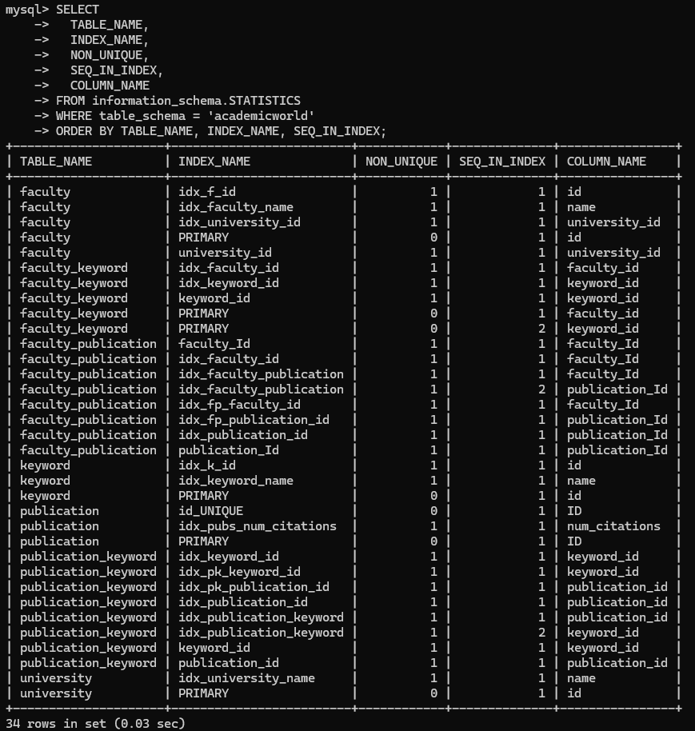

**Neo4j:**  
Indexes created for efficient lookup of nodes, particularly on `FACULTY.name` and `PUBLICATION.id`.

- **Widgets using Neo4j indexes:**  
  - **Widget 5:** Publication–Keyword Graph (`widget5.py`, function: `draw_graph`)
  - **Widget 6:** Cross-database update on research interest (`widget6.py`, function: `update_research_interests`)

- **Why:**  
  Indexes make node lookups in Cypher queries much faster, especially when visualizing publication networks or syncing updates.

- **Code Location:**  
  - Cypher queries in REST API requests in the widget functions listed above.

**Example (Neo4j Cypher):**
```cypher
CREATE INDEX faculty_name_index IF NOT EXISTS FOR (f:FACULTY) ON (f.name);
```
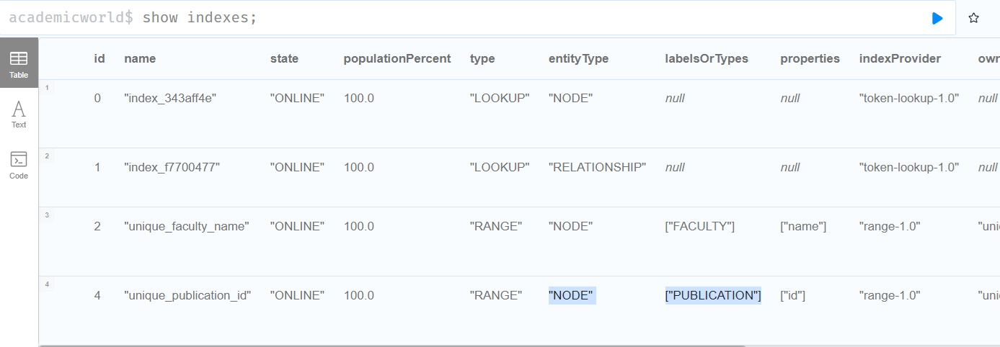
---

### Views (MySQL)

A MySQL view (`faculty_keyword_summary_view`) summarizes the count of faculty per keyword, providing fast aggregate data for charts.

- **Widget using the view:**  
  - **Widget 3:** Top 10 Keywords by Faculty Count (`widget3.py`, function: `update_pie`)

- **Why:**  
  Reduces the computation required at query time, allowing the pie chart to display instantly even as filters change.

- **Code Location:**  
  - SQL query references the view directly in `update_pie` in `widget3.py`.

**Example:**
```sql
SELECT keyword, faculty_count FROM faculty_keyword_summary_view WHERE university = %s
```
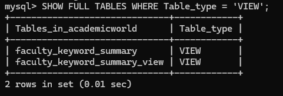
---

### Constraints (Neo4j)

Uniqueness constraints in Neo4j ensure that faculty and publication nodes cannot be duplicated, improving both data integrity and graph query efficiency.

- **Widgets depending on Neo4j constraints:**  
  - **Widget 5:** Publication–Keyword Graph (`widget5.py`, function: `draw_graph`)
  - **Widget 6:** Research interest sync (`widget6.py`, function: `update_research_interests`)

- **Why:**  
  Graph operations assume each node is unique (no duplicates for faculty or publication). Constraints prevent data errors and improve performance.

- **Code Location:**  
  - Cypher setup in Neo4j (run manually or as part of initial data setup).
  - Widget code: Cypher queries in REST calls in `widget5.py` and `widget6.py`.

**Example:**
```cypher
CREATE CONSTRAINT unique_faculty_name IF NOT EXISTS 
FOR (f:FACULTY) REQUIRE f.name IS UNIQUE;
```
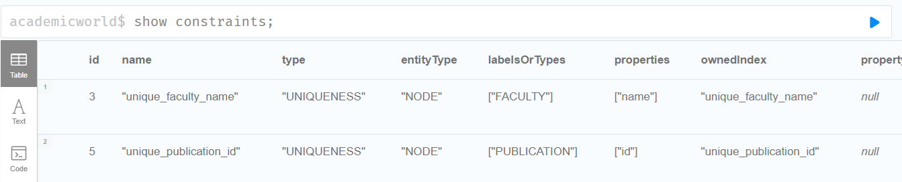
---

### Prepared Statements (MySQL)

All MySQL queries use prepared statements, making them safe from SQL injection and more efficient.

- **Widgets using prepared statements:**  
  - **All widgets that access MySQL** (Widgets 1-4, 6)

- **Why:**  
  Security (prevents SQL injection), efficiency, and safe parameter handling.

- **Code Location:**  
  - See `widget3.py` (`update_pie`), and every `.execute(...)` statement in `widget1.py`, `widget2.py`, etc.

**Example (Python, `utils.py` and widget code):**
```python
            sql = (
                "SELECT keyword, SUM(faculty_count) as faculty_count "
                "FROM faculty_keyword_summary_view "
                "GROUP BY keyword "
                "ORDER BY faculty_count DESC LIMIT 10"
            )

        conn, cur = get_mysql_cursor()
        cur.execute(sql, tuple(params))
        rows = cur.fetchall()
        cur.close()
        conn.close()
```

---

### Transaction

Wraps relational updates in an atomic commit so that partial writes never occur before propagating to other stores.

- **Widget using transactions:**  
  - **Widget 6:** Top 10 Most Cited Publications & Research Interest Update (`widget6.py`, function: `update_research_interests`)  

- **Why:**  
  Ensures that the MySQL update either fully succeeds or fails (rollback), preventing inconsistent state if the subsequent MongoDB or Neo4j writes error out.

- **Code Location:**  
  - In `widget6.py` inside the `update_research_interests` callback  

**Example (Python, from `widget6.py`):**
```python
        conn, cursor = get_mysql_cursor()
        cursor.execute("UPDATE faculty SET research_interest = %s WHERE name = %s", (new_research_interest, selected_prof))

        conn.commit()
        cursor.close()
        conn.close()

        mongo_db.faculty.update_one({"name": selected_prof}, {"$set": {"researchInterest": new_research_interest}})


        cypher = "MATCH (f:FACULTY {name:$name}) SET f.researchInterest=$ri"
        params = {"name": selected_prof, "ri": new_research_interest}
        requests.post(NEO4J_URL, auth=AUTH, headers=HEADERS, json={"statements": [{"statement": cypher, "parameters": params}]})
```

## Extra-Credit Capabilities

- **Automatic Research Interest Generation & Cross-Database Update:**  
  The dashboard can analyze a faculty member’s top publications and recalculate their research interests based on weighted keyword relevance. With one click, the result is updated in MySQL, MongoDB, and Neo4j.
  - **Why it’s useful:**  
    Reduces manual work for admins; demonstrates intelligent data enrichment.
  - **How it was implemented:**  
    The “Update Research Interests” button in Widget 6 (`widget6.py`, function: `update_research_interests`) triggers updates across all databases.

- **Intelligent and Dynamic Dropdown Menus in the Search Bar:**  
  The search bar dropdowns automatically filter options based on user input, auto-select when there’s only one match, and enable/disable related dropdowns dynamically. Dropdown choices for keywords, faculty, and universities are context-sensitive and update based on other selections improving the user experience and making searching faster and less error-prone.
  - **Why it’s useful/cool:**  
    Streamlines the search process, avoids invalid selections, and reduces user confusion.
  - **How it was implemented:**  
    The search bar logic in `app.py` dynamically populates dropdowns and manages their enabled/disabled state using Dash callbacks.
    
## Contributions

- **Justin Hoffman**   jrh10@illinois.edu  
  - Sole developer for the project.
  - Designed and implemented the entire dashboard and all six widgets.
  - Developed database access and integration for MySQL, MongoDB, and Neo4j.
  - Designed and applied custom CSS for a consistent look and feel.
  - Wrote all advanced query logic and incorporated database techniques (views, indexing, constraints, parameterized queries).
  - Performed extensive testing, debugging, and interface polish.
  - Recorded, edited, and narrated the demo video.
  - Wrote this README and all project documentation.

**Estimated time spent:** 60+ hours

---

## Acknowledgments

- **Academic World dataset**: Provided by CS411 course staff.
- **Dash and Plotly**: Open source framework for interactive web applications.
- **Course Teaching Assistants and Instructors**: For providing clear requirements, feedback, and project samples.
- **Illinois MediaSpace**: For video hosting.

